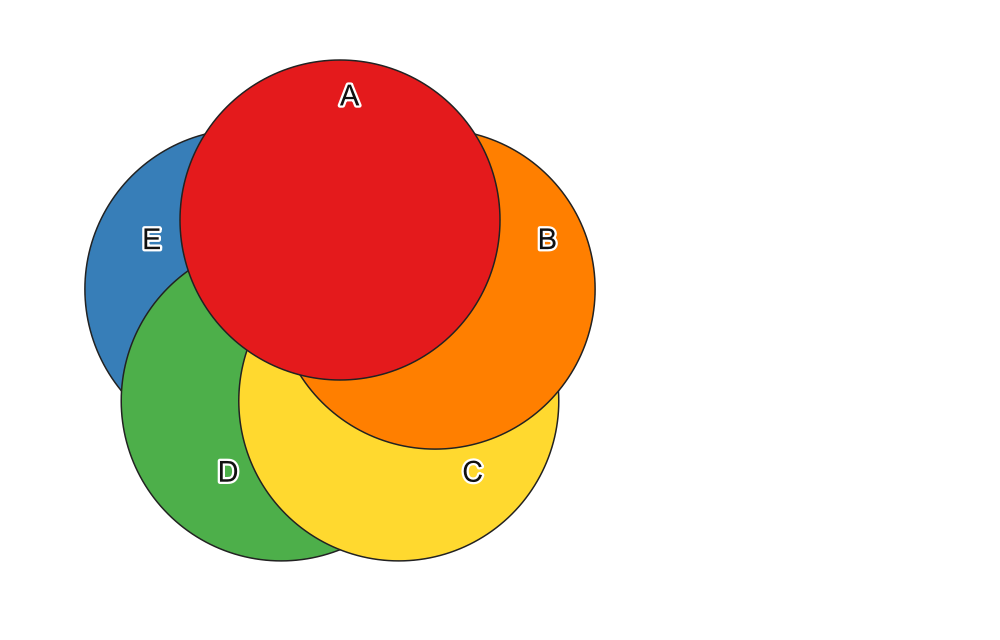
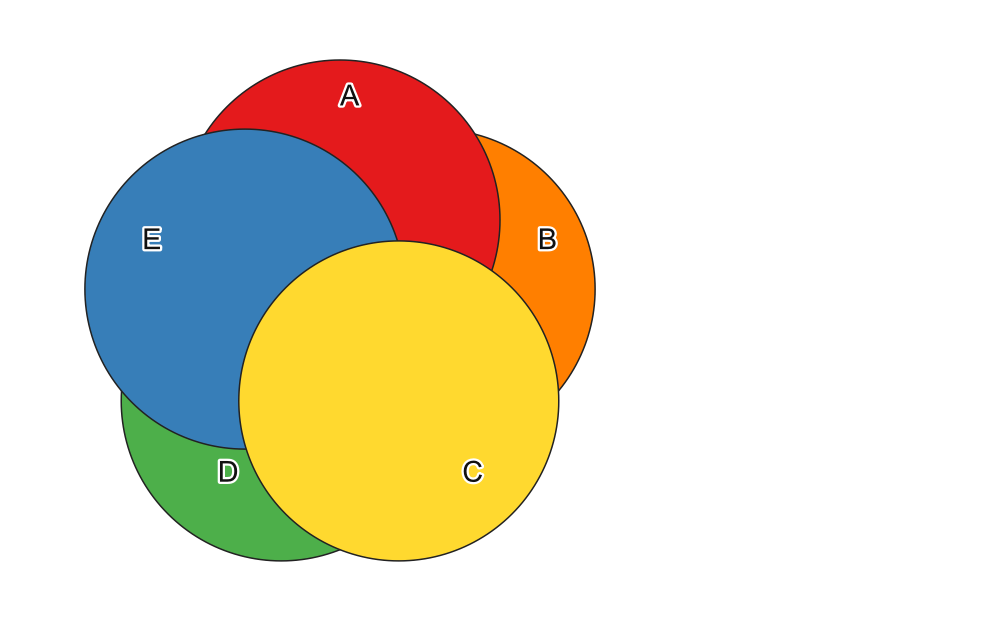
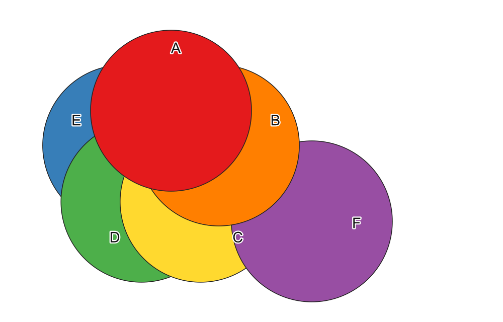

# Advanced Layer Order — Manual acceptance test

*ALO* below stands for Advanced Layer Order, the plugin under test.

This plan covers what only a person can check:

* real mouse drags, drop indicators and cursors, keyboard focus and
  shortcuts;
* what the map and QGIS's own panels **actually show on screen**;
* the plugin manager, saving, restarting QGIS, and macOS specifics.

Run `make test` and `make qgis-test` first (see
[`ARCHITECTURE.md`](ARCHITECTURE.md#tests)). `tests/qgis/check_manual_plan.py`
replays sections 1–7 of this plan headless on the same data: it performs
each step through the same entry points the UI uses and asserts the
ALO / Native / Map columns below. The expected results are therefore
known to be right; the manual run confirms that a real user, with a real
mouse and screen, gets them.

Note the build (`VERSION`, or Plugins → Manage and Install Plugins) and
mark each row **Pass / Fail**.

---

## Test data

`tests/data/test.qgz` with `tests/data/test_layers.gpkg`, regenerated by
`make test-data` (`tests/data/make_test_project.py`).

| Layer | Colour | Where |
|---|---|---|
| A | red | top disc |
| B | orange | upper right |
| C | yellow | lower right |
| D | green | lower left |
| E | blue | upper left |
| F | purple | lower right, overlapping C — **not in the project**: added in section 7 |

**How to read the map.** All five discs overlap in the centre, and each
keeps a labelled outer part.

* **The centre shows the colour of the layer drawn on top**, which is the
  first layer of QGIS's Layer Order panel.
* Where two neighbouring discs overlap (A–B, B–C, C–D, D–E, E–A), you see
  the one drawn higher.

Example: the order C E A D B gives a yellow centre (C), with E covering A
and D, and A covering B:

**The project as saved** reproduces known traps:

* Layers panel order: A B C D E (top to bottom).
* "Control rendering order" is **off**, and a stale custom order
  E D C B A is stored.
* No Advanced Layer Order tree is saved.

### Notation

* **ALO**: the Advanced Layer Order tree, groups as `Name[children]`, e.g.
  `ABCD[AB[A, B], CD[C, D]], E`.
* **Native**: QGIS's **Layer Order** panel (View → Panels → Layer Order),
  top to bottom, e.g. `A B C D E`.
* **Map**: the centre colour, plus an overlap when it tells something
  more.

### Setup

1. Have QGIS 4 — and repeat the plan on QGIS 3.44 — with the **Layers**,
   **Layer Order** and **Advanced Layer Order**
   panels visible, and **View → Panels → Log Messages**, tab
   **AdvancedLayerOrder**, open. Any red message there is a failure.
2. Tick *Verbose logging* in ALO only to investigate a failure.

---

## 0. Install

| # | Action | Expected |
|---|---|---|
| 0.1 | Plugins → Manage and Install Plugins → **Install from ZIP**: `advanced_layer_order-<VERSION>.zip` | Installs without error; the "Advanced Layer Order" panel appears on the left; the Plugins → Advanced Layer Order menu has the panel toggle; QGIS's Edit menu is unchanged; Plugin Manager shows the version from `VERSION` |
| 0.2 | Install the same zip again (upgrade) | Still one plugin entry and one panel |
| 0.3 | Install the same zip in the other QGIS (3.44 or 4.x) | Installs and loads the same way; every section below behaves identically |

## 1. Opening the project and control

Open `tests/data/test.qgz`. The rows are cumulative.

| # | Action | ALO | Native | Map |
|---|---|---|---|---|
| 1.1 | (project just opened) | `A, B, C, D, E`, greyed out, control **off** | checkbox off, greyed: `A B C D E` | centre **red** (A) |
| 1.2 | Tick **Control rendering order** in **ALO** | tree enabled, control on | checkbox **on**: `A B C D E` (not `E D C B A`) | centre red |
| 1.3 | Untick it in ALO | greyed, control off | checkbox off: `A B C D E` | centre red |
| 1.4 | Tick it in the **Native** panel | follows: control on, tree enabled | `A B C D E` | centre red |
| 1.5 | In the **Layers** panel, drag E to the top | unchanged | unchanged | centre still **red**: the custom order rules |
| 1.6 | Untick control (either panel) | control off | `E A B C D` (the Layers panel order) | centre **blue** (E) |
| 1.7 | Layers panel: drag E back to the bottom; tick control again | control on, `A, B, C, D, E` | `A B C D E` | centre red |

## 2. Groups — the baseline

| # | Action | ALO | Native | Map |
|---|---|---|---|---|
| 2.1 | Select A, B → **Create group** (toolbar) → "AB" | `AB[A, B], C, D, E`, AB expanded and selected | `A B C D E` | unchanged: groups never change the order |
| 2.2 | Select C, D → right-click → **Create group** → "CD" | `AB[A, B], CD[C, D], E` | `A B C D E` | unchanged |
| 2.3 | Select AB and CD → **Create group** → "ABCD" | **baseline**: `ABCD[AB[A, B], CD[C, D]], E` | `A B C D E` | centre red |
| 2.4 | **File → Save As** `~/lop-baseline.qgz` (outside the repository) | — | — | — |
| 2.5 | Rename CD (toolbar) to "CD2", then delete CD2 (context menu) | `ABCD[AB[A, B], C, D], E` | `A B C D E` | unchanged |
| 2.6 | **↶ Undo** twice | baseline, CD named CD again | `A B C D E` | unchanged |
| 2.7 | Nothing selected → **Create group** | an empty "New group" at the bottom | unchanged | unchanged |
| 2.8 | Collapse ABCD with its arrow; expand it by double-click; collapse with ←; expand with → | toggles each time; the state stays through later edits | — | — |

**"Reopen the baseline"** below means **File → Open**
`~/lop-baseline.qgz`, discarding changes.

## 3. Drag and drop in ALO (mouse)

Reopen the baseline before each row.

| # | Action | ALO | Native | Map |
|---|---|---|---|---|
| 3.1 | Drag E **above** A (the line appears above A) | `ABCD[AB[E, A, B], CD[C, D]]` | `E A B C D` | centre **blue** |
| 3.2 | Drag E **below** D (line below D) | `ABCD[AB[A, B], CD[C, D, E]]` | `A B C D E` | centre red; D–E overlap **green** |
| 3.3 | Drag E **onto** AB (AB highlighted) | `ABCD[AB[A, B, E], CD[C, D]]` | `A B E C D` | centre red; D–E overlap **blue** |
| 3.4 | Drag C into the **empty area** below the list | `ABCD[AB[A, B], CD[D]], E, C` | `A B D E C` | centre red; C–D overlap **green**; B–C overlap **orange** |
| 3.5 | Drag E **onto** C | `ABCD[AB[A, B], CD[New group[C, E], D]]`, the new group expanded | `A B C E D` | centre red; D–E overlap **blue** |
| 3.6 | **↶ Undo** | baseline | `A B C D E` | centre red |
| 3.7 | Click D, Ctrl-click C (reverse order), drag both **above** A | `ABCD[AB[C, D, A, B], CD[]], E` (CD kept, empty) | `C D A B E` | centre **yellow** |
| 3.8 | Drag ABCD onto AB | "no drop" cursor; nothing changes | unchanged | unchanged |
| 3.9 | Scroll the list a little, collapse CD, then make any drop | the scroll position and CD's collapsed state don't change; the moved items are selected | — | — |

## 4. Move up / down

Reopen the baseline. The rows are cumulative.

| # | Action | ALO | Native | Map |
|---|---|---|---|---|
| 4.1 | Select B → toolbar **▲** | `ABCD[AB[B, A], CD[C, D]], E` | `B A C D E` | centre **orange** |
| 4.2 | **▲** again | unchanged: B is first in AB | `B A C D E` | orange |
| 4.3 | Select group CD → **Ctrl+↑** (⌘↑ on macOS) | `ABCD[CD[C, D], AB[B, A]], E` | `C D B A E` | centre **yellow** |
| 4.4 | Select C and D → **▼** | unchanged: the block fills CD | `C D B A E` | yellow |
| 4.5 | **↶ Undo** twice | baseline | `A B C D E` | centre red |
| 4.6 | Select E → right-click → **Move up** | `E, ABCD[AB[A, B], CD[C, D]]` | `E A B C D` | centre **blue** |
| 4.7 | Clear the selection | ▲ and ▼ disabled | — | — |

## 5. Dragging in QGIS's Layer Order panel

Reopen the baseline, then drag in the **Native** panel. The rows are
cumulative. **In every row, no layer other than the dragged one may
change group in ALO.**

| # | Action (Native panel) | ALO | Native | Map |
|---|---|---|---|---|
| 5.1 | Drag E between A and B | `ABCD[AB[A, E, B], CD[C, D]]` | `A E B C D` | centre red; E–A overlap **red** |
| 5.2 | Drag E to the very top | `ABCD[AB[E, A, B], CD[C, D]]`: E stays in AB *(group-edge rule under discussion)* | `E A B C D` | centre **blue** |
| 5.3 | Drag E between A and B again | `ABCD[AB[A, E, B], CD[C, D]]`: **A is still in AB** | `A E B C D` | centre red |
| 5.4 | Drag E to the bottom | `ABCD[AB[A, B], CD[C, D]], E` | `A B C D E` | centre red; D–E overlap **green** |
| 5.5 | Drag E between C and D | `ABCD[AB[A, B], CD[C, E, D]]` | `A B C E D` | D–E overlap **blue** |
| 5.6 | Drag B above A | `ABCD[AB[B, A], CD[C, E, D]]` | `B A C E D` | centre **orange** |

## 6. Visibility

Reopen the baseline. The rows are cumulative.

| # | Action | ALO | Layers and Native panels | Map |
|---|---|---|---|---|
| 6.1 | Untick C in **ALO** | C unticked; CD partially ticked | C unticked | yellow disc gone; centre red |
| 6.2 | Tick C in the **Layers** panel | C ticked again | — | yellow back |
| 6.3 | Untick group AB in ALO | A and B unticked | A and B unticked | red and orange gone; centre **yellow** |
| 6.4 | Tick AB in ALO | A and B ticked | ticked | centre red |
| 6.5 | Layers panel: create a group "QG", move D into it, untick QG | D unticked (it isn't drawn) | D ticked, QG unticked | green gone |
| 6.6 | Tick D in **ALO** | D ticked | QG ticked again | green back |

## 7. Layers added, renamed, removed

Reopen the baseline. The rows are cumulative unless they say otherwise.

| # | Action | ALO | Native | Map |
|---|---|---|---|---|
| 7.1 | Select C in the **Layers** panel; add layer F (Browser → `tests/data/test_layers.gpkg` → F, or Layer → Add Layer) | `ABCD[AB[A, B], CD[F, C, D]], E` | `A B F C D E` | purple F at the lower right, **above C** (the F–C overlap is purple; picture below) |
| 7.2 | Rename F to "F2" in the Layers panel | renamed | renamed | — |
| 7.3 | Select B → **▲**, then **↶ Undo** | after ▲: `AB[B, A]`; after Undo: `ABCD[AB[A, B], CD[F2, C, D]], E`: the move is undone, **F2 stays** | `A B F2 C D E` | centre red |
| 7.4 | Remove F2 | `ABCD[AB[A, B], CD[C, D]], E` | `A B C D E` | purple gone |
| 7.5 | *Remove empty groups* **on**: remove C and D | `ABCD[AB[A, B]], E` (CD removed) | `A B E` | yellow and green gone |
| 7.6 | Reopen the baseline; *Remove empty groups* **off**; remove C and D | `ABCD[AB[A, B], CD[]], E` (the empty CD is kept) | `A B E` | — |
| 7.7 | Reopen the baseline; *Remove empty groups* **on**; nothing selected → Create group "Later"; remove E | `ABCD[AB[A, B], CD[C, D]], Later[]`: **Later survives** | `A B C D` | blue gone |

## 8. Undo / redo

Reopen the baseline. The rows are cumulative.

| # | Action | Expected |
|---|---|---|
| 8.1 | (baseline just reopened) | ↶ and ↷ greyed out |
| 8.2 | Do 4.1 and 4.3 (two moves); hover ↶ | tooltip "Undo: Move up" |
| 8.3 | **↶ Undo** | one step undone (state of 4.1, centre orange); ↷ enabled, tooltip "Redo: Move up" |
| 8.4 | **↶ Undo**, then **↷ Redo** twice | baseline (centre red), then centre orange, then yellow; ↷ greyed out at the end |
| 8.5 | Focus in the ALO tree, press **Ctrl+Z** (⌘Z) and **Ctrl+Y** | nothing happens to the layer order (ALO has no undo shortcut) |
| 8.6 | Toggle editing on layer A, move a vertex; focus in the **ALO panel**, Ctrl+Z | QGIS undoes the vertex move; the layer order doesn't change; then stop editing without saving |
| 8.7 | Collapse ABCD, then **↶ Undo** | ABCD stays collapsed (expansion isn't undone) |
| 8.8 | Reopen the baseline. ALO: ▲ on B. **Native** panel: drag D above C. Then **↶ Undo** twice, then **↷ Redo** twice | 1st Undo: D back below C (native `B A C D E`), tooltip was "Undo: Reorder in QGIS's Layer Order panel"; 2nd: B back below A (`A B C D E`, centre red); the two Redo replay both (`B A D C E`, centre orange) |

## 9. Saving, closing, switching projects, restarting

| # | Action | Expected |
|---|---|---|
| 9.1 | Reopen the baseline; File → **Close** | the ALO panel **stays open**, empty; the Native panel is empty |
| 9.2 | Open `~/lop-baseline.qgz` | ALO: the baseline tree, expansion as saved; Native `A B C D E`; centre red; the window title shows **no** "modified" mark; ↶ Undo greyed out |
| 9.3 | Then open `tests/data/test.qgz` (discard changes) | ALO: `A, B, C, D, E` with **no** group from the previous project |
| 9.4 | Tab the ALO panel behind the Layers panel, switch tabs, close and reopen a project | ALO is still in its tab |
| 9.5 | Plugins → Advanced Layer Order → **Advanced Layer Order** | hides or shows the panel; the menu tick follows |
| 9.6 | Put the panel somewhere else; quit QGIS; restart | the panel comes back at the same place, with the same visibility |

## 10. macOS only

| # | Action | Expected |
|---|---|---|
| 10.1 | ⌘↑ / ⌘↓ on a selected layer in ALO | moves it, as in section 4 |
| 10.2 | ⌘Z with the focus in ALO | nothing happens to the layer order (as 8.5) |
